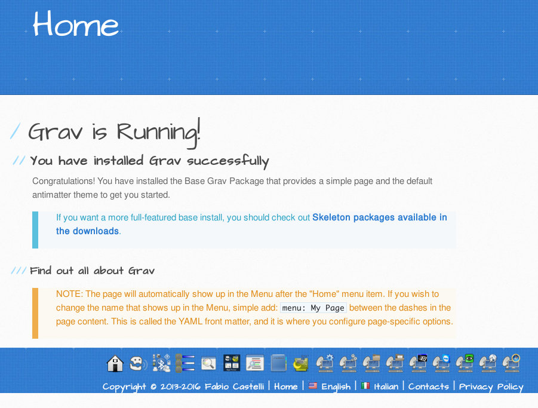

# Grav Muflone theme

`muflone` is a [Grav][grav] theme specific to the Grav Theme Muflone website.

# Installation

To install this plugin, just download the zip version of this repository and
unzip it under `/your/site/grav/user/themes`.
Then, rename the folder to `muflone`.

You should now have all the theme files under

    /your/site/grav/user/themes/muflone

# Requirements

The Muflone theme requires also the following plugins:
  * [grav-plugin-shortcode-muflone]
  * [grav-plugin-shortcode-core]

[grav]: http://github.com/getgrav/grav
[grav-plugin-shortcode-muflone]: https://github.com/muflone/grav-plugin-muflone
[grav-plugin-shortcode-core]: https://github.com/getgrav/grav-plugin-shortcode-core
